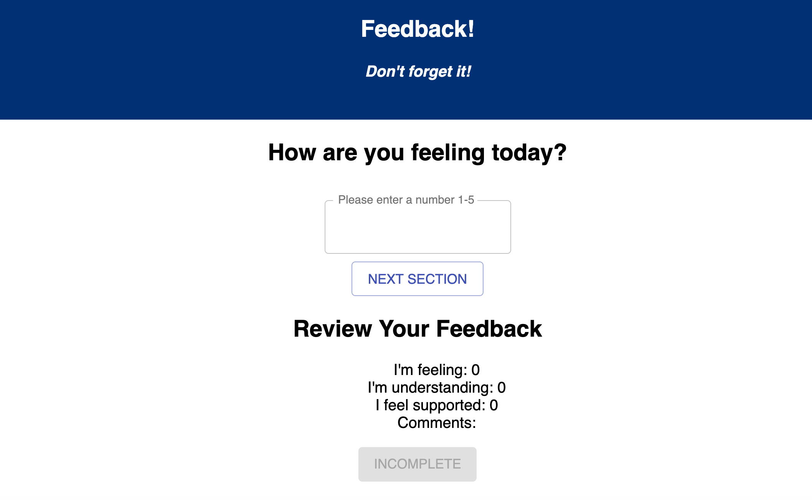
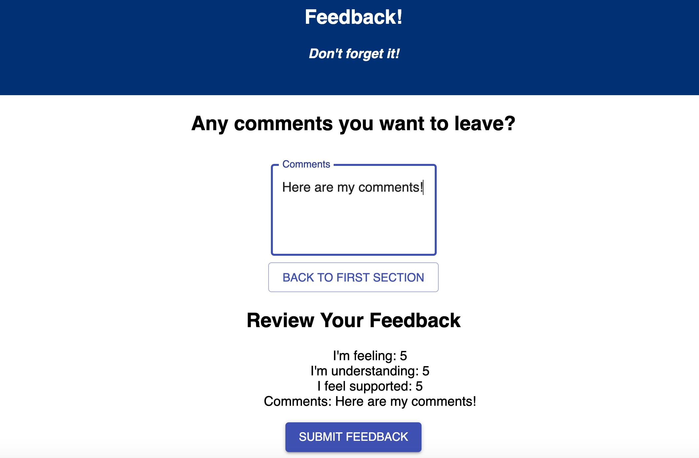
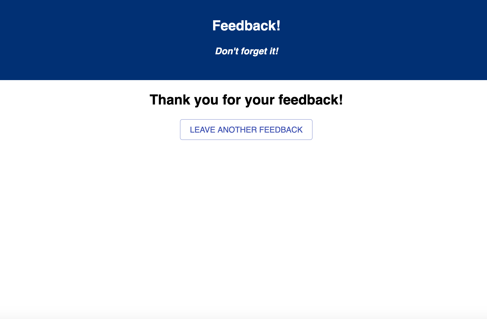

# Redux Feedback Loop

Redux Feedback Loop is a React-based application modeled after Prime's daily feedback form. Over 4 views, users enter their feedback about how they're feeling, how well they understood today's material, and how supported they feel on a scale from 1-5, as well as any additional comments they want to add. The current feedback is displayed in a separate part of the page, and once all 4 pieces of feedback have been entered, the submit button is enabled and users are able to submit their feedback to the database. They are then brought to a success page that thanks them for their feedback, with an option to leave another feedback. 

## Built With
* React
* React Redux
* React Router
* Node.js
* Express
* Postico
* PostgreSQL
* Material-UI

## Getting Started

### Prerequisites
* Node.js
* nodemon
* PostgreSQL

### Installing
Steps to get the development environment running.

1. Fork and clone repository.
2. Make a PostgreSQL database called `prime_feedback`. Create database table via instructions in `data.sql` file in repository. 
3. Once in the project folder, inside the terminal run `npm install` and then `npm run server`.
4. Open a new terminal window and start the application by running `npm run client`.

## Screenshots

Main view of the application:

Once all portions of the feedback are completed, the submit button is enabled:

After submitting: 

### Completed Features
- [x] Allow users to add 1-5 feedback for Feeling, Understanding, and Support (only allow users to enter a number from 1-5)
- [x] Application cycles through components via Hash Router
- [x] Allow users to add comments in the Comments section
- [x] Separate Review component that displays current feedback information
- [x] Users are only allowed to submit feedback to database once all fields are completed and valid
- [x] Successful submission brings user to success page and allows them to start over if they want, clearing feedback held in Redux

### Next Steps
- [] Display all existing feedback in an Admin section
- [] Allow feedback to be deleted or flagged for further review in Admin section
- [] Deploy app to Heroku

## Authors
* Rachel Schoenmann

## Acknowledgements
* Dane Smith
* Dev Jana
* Ally Boyd
* Prime Digital Academy
* Baconian Cohort
